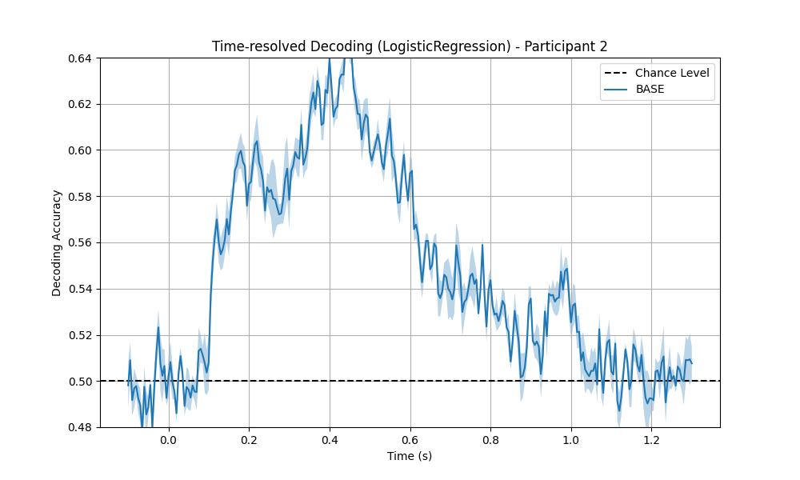
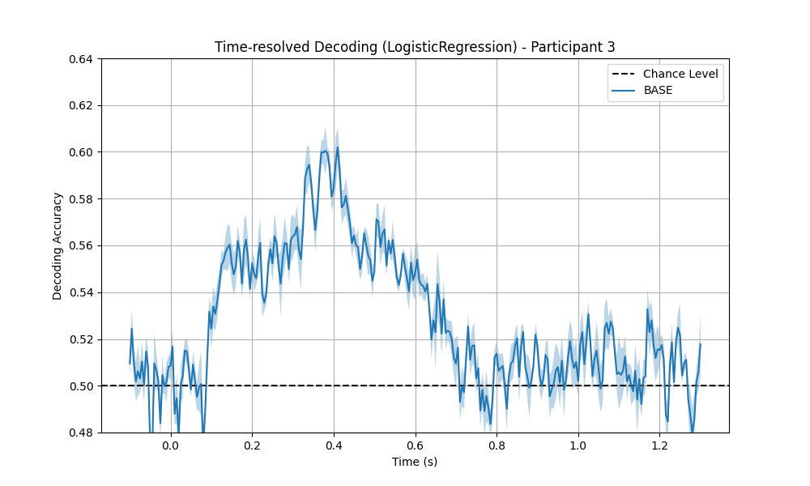
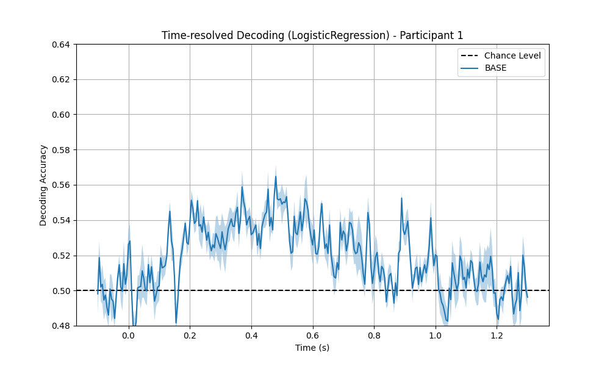
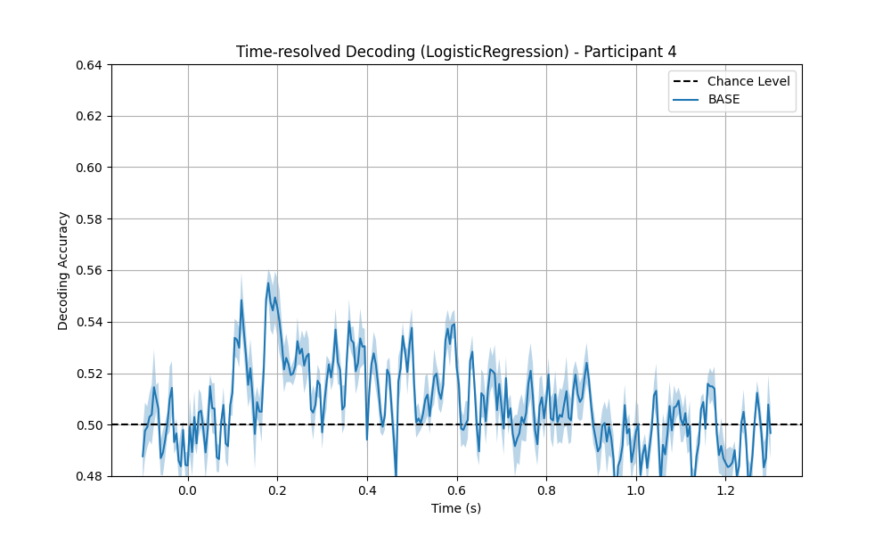
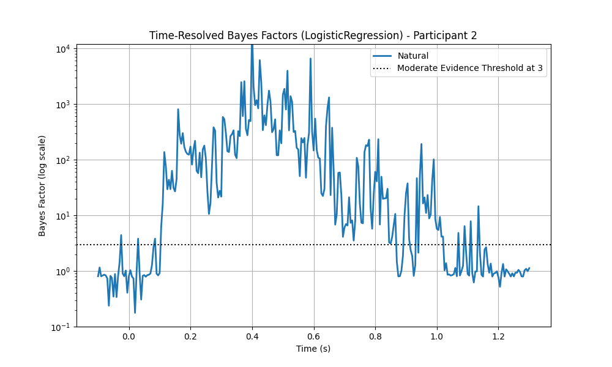

# Natural vs. Human-Made Experiment

## Abstract

This exploratory study investigates the neural differentiation between natural and human-made objects using Magnetoencephalography (MEG) data from the [THINGS Initiative](https://things-initiative.org/). The study leverages the [THINGS-MEG Dataset](https://plus.figshare.com/articles/dataset/THINGS-data_MEG_BIDS_raw_dataset/20563800?backTo=%2Fcollections%2FTHINGS-data_A_multimodal_collection_of_large-scale_datasets_for_investigating-object_representations_in_brain_and_behavior%2F6161151&file=36827316) and preprocessing pipelines from the [THINGS-MEG Code](https://github.com/ViCCo-Group/THINGS-data) described in [Hebart, Contier, Teichmann et al. (2023)](https://doi.org/10.7554/eLife.82580). The goal is to pinpoint when neural activity diverges between natural and human-made object supracategories and how stable they are over time, providing insight into perceptual and cognitive processes shaped by evolutionary experience.

## Introduction

In this exploratory analysis, I use MEG data to evaluate how the human brain differentiates between natural and human-made objects. Each of the four participants viewed 22,248 images, covering 1,854 categories (12 images per category) across 12 sessions ([Hebart, Contier, Teichmann et al., 2023](https://doi.org/10.7554/eLife.82580)). For this study, I have grouped these categories into two broad supracategories (natural and human-made) by relying on the 53 high-level categories defined in [THINGSplus](https://psyarxiv.com/exu9f) and its corresponding [database](https://osf.io/jum2f).

## Research Objective

The primary objective of this work is to determine the precise time point at which neural activity begins to distinguish between natural and human-made objects. I hypothesize that neural responses to natural images may exhibit a more stable pattern, resilient to time, reflecting evolutionary adaptation to natural environments. This distinct neural signature should help classifiers differentiate between these supracategories, despite challenges posed by the inherent data imbalance (with approximately 25% of images belonging to the natural category).

## Methodology

### Time-Resolved Decoding

I performed time-resolved decoding by training classification models independently at each time point using 5-fold cross-validation. To address the dataset’s class imbalance, balanced accuracy was used as the performance metric. The classifiers evaluated include:

- Linear Discriminant Analysis (LDA)
- Logistic Regression

The implemented pipeline can also easily make use of the following models, which, however, require more computation time and/or lead to worse accuracies:

- Gaussian Naïve Bayes
- Random Forest
- Multilayer Perceptron (MLP)
- XGBoost

Model significance was determined via Bayes factor analysis (see [Teichmann et al., 2022](https://doi.org/10.52294/ApertureNeuro.2022.2.MAOC6465)), ensuring that the findings exceed chance performance reliably.

### Temporal Generalization Analysis

To capture the evolution of neural representations over time, I adopted a three-phase strategy:

1. **Training Phase:**  
   Models were trained independently per participant using data from three blocks: `BASE`, `EARLY`, and `LATE`. These blocks were chosen to minimize within-block time spans while maximizing between blocks time spans (see tables in section **Blocks Summary** and **Sessions Summary**).

2. **Within-Block Evaluation Phase:**  
   Trained models were evaluated using data from the same block and I followed a 5-fold cross-validation strategy.

3. **Across-Block Prediction Phase:**  
   Models trained on the `BASE` block were used to predict outcomes on the `EARLY` and `LATE` blocks. This approach, inspired by previous work ([Teichmann et al., 2018a](https://doi.org/10.1162/jocn_a_01257); [2018b](https://doi.org/10.1101/369926)), allowed me to assess the temporal stability of the identified neural features. In addition, I computed the Dynamic Time Warping (DTW) distance (inspired by [Teichmann et al., 2023](https://doi.org/10.1101/2023.09.08.556679)) and the Pearson correlation between accuracy profiles from BASE-trained models and those from EARLY and LATE blocks when using the BASE-trained model.

## Results

The accompanying tables in section **Results Summary** illustrate classifiers performance across participants and blocks. Key metrics include accuracies and Bayes factor values (limited to the region from 75 to 975 ms) for both within-block evaluations (TRAIN) and across-block predictions (PREDICT). The tables also include DTW distances and Pearson correlations for across-block predictions (PREDICT).

Notably, the Logistic Regression model consistently yielded higher accuracies compared to LDA (e.g., an average of 0.57 versus 0.53 for participant 2), and thus was adopted as the reference model for subsequent analysis. While some participants (e.g., participants 2 and 3) exhibited robust and clear neural distinctions between natural and human-made objects, others showed noisier results. In terms of stability across blocks at different moments in time, the Pearson correlation coefficient suggest a relatively consistent pattern, although for certain participants, there are some small divergent DTW distance trends.

To illustrate the time-resolved accuracy stability over time (i.e., across blocks), the following animated figures represents its evolution when using the BASE-trained model to evaluate data from the BASE, EARLY and LATE blocks. In particular, for **participant 2** (EARLY and LATE blocks have an average of **10.7 and 19.7 days** since first recording, respectively):



And for **participant 3** (EARLY and LATE blocks have an average of **24.7 and 43 days** since first recording, respectively):



Furthermore, for participants with worse accuracy levels, their patterns also seem roughly stable over time when inspected visually:





It is worth noting that participants sex does not seem to play a role in the high/low accuracy patterns shown above. Participant 1 and 2 are males, while 3 and 4 are females. But participants 2 and 3 have more similar accuracies and patterns, while 1 and 4 present lower accuracies.

Another interesting aspect is that the time-resolved accuracy, especially for participants 2 and 3, show two components that peak around 0.2 and 0.4 seconds. A hint of the two peaks can also be observed when looking at the Bayes factors from BASE block results for participant 2:



## Conclusions

These findings demonstrate that time-resolved MEG decoding can successfully capture the neural differentiation between natural and human-made objects. The study leads to several key conclusions:

- **Temporal Differentiation:**  
  Neural responses begin to reliably differentiate between the two supracategories within a specific post-stimulus window, showing two components.

- **Model Selection:**  
  Logistic Regression emerged as the most effective classifier for this task, yielding consistent improvements in balanced accuracy over other models.

- **Inter-Participant Variability:**  
  Variability in neural response patterns across participants suggests that while some individuals exhibit robust differentiation, others present more variable or noisy signals.

- **Future Directions:**  
  The current grouping into natural versus human-made objects provides valuable insights; however, exploring alternative supracategory definitions may yield more balanced training sets and enhance model performance. Future work could also focus on better understanding the variability across participants, as well as exploring the MEG sensor activation patterns. Furthermore, it could also be interesting to consider the [THINGS-EEG Data](https://www.nature.com/articles/s41597-021-01102-7) and the [THINGS-EEG Code](https://osf.io/hd6zk/), described in the [THINGS-EEG Paper](https://www.nature.com/articles/s41597-021-01102-7) to complement the MEG data used in this work.

In summary, this study provides a valuable approach for understanding how evolutionary adaptations to natural environments may be reflected in stable neural patterns, thereby advancing our knowledge of object perception and neural representation.

## Supplementary Material

### Results Summary

#### Linear Discriminant Analysis (LDA)

|   participant | origin   | block   |   accuracy_mean |   accuracy_std |   bayes_factor_mean |   bayes_factor_std |   accuracy_dtw_dist |   accuracy_pearson_corr |
|--------------:|:---------|:--------|----------------:|---------------:|--------------------:|-------------------:|--------------------:|------------------------:|
|             1 | TRAIN    | BASE    |        0.507222 |     0.00625477 |           0.371676  |           0.485685 |                     |                         |
|             1 | TRAIN    | EARLY   |        0.50562  |     0.00628169 |           0.292655  |           0.485821 |                     |                         |
|             1 | PREDICT  | EARLY   |        0.510273 |     0.00620389 |           0.453468  |           0.443285 |             1.04529 |                0.472168 |
|             1 | TRAIN    | LATE    |        0.503385 |     0.00595451 |           0.156587  |           0.499294 |                     |                         |
|             1 | PREDICT  | LATE    |        0.505931 |     0.00696057 |           0.226     |           0.439005 |             1.06704 |                0.251986 |
|             2 | TRAIN    | BASE    |        0.533087 |     0.0218661  |           1.23817   |           0.796373 |                     |                         |
|             2 | TRAIN    | EARLY   |        0.534508 |     0.0210757  |           1.31874   |           0.770174 |                     |                         |
|             2 | PREDICT  | EARLY   |        0.528449 |     0.0181717  |           1.15176   |           0.63744  |             1.36283 |                0.929925 |
|             2 | TRAIN    | LATE    |        0.529733 |     0.0189597  |           1.12772   |           0.716996 |                     |                         |
|             2 | PREDICT  | LATE    |        0.523793 |     0.0169994  |           1.08842   |           0.742689 |             1.24683 |                0.931734 |
|             3 | TRAIN    | BASE    |        0.514933 |     0.0136272  |           0.67415   |           0.695645 |                     |                         |
|             3 | TRAIN    | EARLY   |        0.517655 |     0.015239   |           0.811558  |           0.782621 |                     |                         |
|             3 | PREDICT  | EARLY   |        0.516613 |     0.0140129  |           0.797193  |           0.73249  |             1.16881 |                0.866207 |
|             3 | TRAIN    | LATE    |        0.515771 |     0.0141597  |           0.701296  |           0.726896 |                     |                         |
|             3 | PREDICT  | LATE    |        0.514579 |     0.0102589  |           0.770607  |           0.661387 |             1.18267 |                0.799493 |
|             4 | TRAIN    | BASE    |        0.505305 |     0.007124   |           0.279157  |           0.508166 |                     |                         |
|             4 | TRAIN    | EARLY   |        0.502873 |     0.00567814 |           0.118676  |           0.391612 |                     |                         |
|             4 | PREDICT  | EARLY   |        0.503703 |     0.00524356 |           0.0955349 |           0.339938 |             1.05578 |                0.220965 |
|             4 | TRAIN    | LATE    |        0.503353 |     0.00650596 |           0.168869  |           0.421035 |                     |                         |
|             4 | PREDICT  | LATE    |        0.50674  |     0.00633593 |           0.324777  |           0.435646 |             1.07123 |                0.443793 |

#### Logistic Regression

|   participant | origin   | block   |   accuracy_mean |   accuracy_std |   bayes_factor_mean |   bayes_factor_std |   accuracy_dtw_dist |   accuracy_pearson_corr |
|--------------:|:---------|:--------|----------------:|---------------:|--------------------:|-------------------:|--------------------:|------------------------:|
|             1 | TRAIN    | BASE    |        0.527352 |      0.0156728 |            0.872646 |           0.697965 |                     |                         |
|             1 | TRAIN    | EARLY   |        0.520628 |      0.0159691 |            0.674622 |           0.65331  |                     |                         |
|             1 | PREDICT  | EARLY   |        0.531592 |      0.0162651 |            0.908966 |           0.609588 |             2.45093 |                0.653861 |
|             1 | TRAIN    | LATE    |        0.521916 |      0.0133647 |            0.672367 |           0.54663  |                     |                         |
|             1 | PREDICT  | LATE    |        0.522118 |      0.0143778 |            0.645225 |           0.612461 |             1.95988 |                0.636529 |
|             2 | TRAIN    | BASE    |        0.569304 |      0.0375802 |            1.83638  |           0.913457 |                     |                         |
|             2 | TRAIN    | EARLY   |        0.570468 |      0.0339723 |            1.80033  |           0.869016 |                     |                         |
|             2 | PREDICT  | EARLY   |        0.569793 |      0.0334517 |            1.66503  |           0.85649  |             2.11972 |                0.936264 |
|             2 | TRAIN    | LATE    |        0.565551 |      0.034605  |            1.6841   |           0.891291 |                     |                         |
|             2 | PREDICT  | LATE    |        0.56145  |      0.0332061 |            1.5578   |           0.850851 |             2.15012 |                0.937506 |
|             3 | TRAIN    | BASE    |        0.539302 |      0.0295208 |            1.17607  |           0.931639 |                     |                         |
|             3 | TRAIN    | EARLY   |        0.542223 |      0.02869   |            1.16335  |           0.86607  |                     |                         |
|             3 | PREDICT  | EARLY   |        0.543174 |      0.0270402 |            1.22329  |           0.866751 |             2.08389 |                0.882968 |
|             3 | TRAIN    | LATE    |        0.543991 |      0.0264435 |            1.27806  |           0.854651 |                     |                         |
|             3 | PREDICT  | LATE    |        0.544933 |      0.0234645 |            1.31444  |           0.772042 |             2.29383 |                0.860313 |
|             4 | TRAIN    | BASE    |        0.513773 |      0.0151517 |            0.371489 |           0.56119  |                     |                         |
|             4 | TRAIN    | EARLY   |        0.516187 |      0.0144136 |            0.473499 |           0.573616 |                     |                         |
|             4 | PREDICT  | EARLY   |        0.513805 |      0.0114874 |            0.36536  |           0.533583 |             2.34121 |                0.413069 |
|             4 | TRAIN    | LATE    |        0.513804 |      0.0143935 |            0.376915 |           0.516805 |                     |                         |
|             4 | PREDICT  | LATE    |        0.518742 |      0.0132585 |            0.52109  |           0.563776 |             2.18472 |                0.459214 |


### Blocks Summary

|   participant | block   | since_start | block_timespan |
|--------------:|:--------|------------:|---------------:|
|             1 | BASE    |         5   |              8 |
|             1 | EARLY   |        13.7 |              3 |
|             1 | LATE    |        28   |              2 |
|             2 | BASE    |         2.3 |              6 |
|             2 | EARLY   |        10.7 |              3 |
|             2 | LATE    |        19.7 |              3 |
|             3 | BASE    |         3   |              7 |
|             3 | EARLY   |        24.7 |              9 |
|             3 | LATE    |        43   |              2 |
|             4 | BASE    |         5.3 |              9 |
|             4 | EARLY   |        28.3 |              7 |
|             4 | LATE    |        69   |              8 |

Fields `since_start` and `block_timespan` represent the average number of days since the first recording and the number of days that each block covers.

### Sessions Summary

|   participant | sex   |   session | recording_datetime        |   days_since_first_recording | block    |
|--------------:|:------|----------:|:--------------------------|-----------------------------:|---------:|
|             1 | M     |         1 | 2019-06-13 12:13:00+00:00 |                            0 | BASE     |
|             1 | M     |         2 | 2019-06-20 12:44:00+00:00 |                            7 | BASE     |
|             1 | M     |         3 | 2019-06-21 12:18:00+00:00 |                            8 | BASE     |
|             1 | M     |         4 | 2019-06-24 12:15:00+00:00 |                           11 |          |
|             1 | M     |         5 | 2019-06-25 12:14:00+00:00 |                           12 | EARLY    |
|             1 | M     |         6 | 2019-06-27 12:42:00+00:00 |                           14 | EARLY    |
|             1 | M     |         7 | 2019-06-28 12:15:00+00:00 |                           15 | EARLY    |
|             1 | M     |         8 | 2019-07-03 12:18:00+00:00 |                           20 |          |
|             1 | M     |         9 | 2019-07-08 12:22:00+00:00 |                           25 |          |
|             1 | M     |        10 | 2019-07-10 12:45:00+00:00 |                           27 | LATE     |
|             1 | M     |        11 | 2019-07-11 12:28:00+00:00 |                           28 | LATE     |
|             1 | M     |        12 | 2019-07-12 12:14:00+00:00 |                           29 | LATE     |
|             2 | M     |         1 | 2019-05-30 11:26:00+00:00 |                            0 | BASE     |
|             2 | M     |         2 | 2019-05-31 11:17:00+00:00 |                            1 | BASE     |
|             2 | M     |         3 | 2019-06-05 09:14:00+00:00 |                            6 | BASE     |
|             2 | M     |         4 | 2019-06-07 07:39:00+00:00 |                            8 |          |
|             2 | M     |         5 | 2019-06-08 08:40:00+00:00 |                            9 | EARLY    |
|             2 | M     |         6 | 2019-06-10 11:15:00+00:00 |                           11 | EARLY    |
|             2 | M     |         7 | 2019-06-11 11:57:00+00:00 |                           12 | EARLY    |
|             2 | M     |         8 | 2019-06-12 09:04:00+00:00 |                           13 |          |
|             2 | M     |         9 | 2019-06-17 11:11:00+00:00 |                           18 | LATE     |
|             2 | M     |        10 | 2019-06-19 11:10:00+00:00 |                           20 | LATE     |
|             2 | M     |        11 | 2019-06-20 11:07:00+00:00 |                           21 | LATE     |
|             2 | M     |        12 | 2019-07-02 10:53:00+00:00 |                           33 |          |
|             3 | M     |         1 | 2019-05-05 17:36:00+00:00 |                            0 | BASE     |
|             3 | M     |         2 | 2019-05-07 17:00:00+00:00 |                            2 | BASE     |
|             3 | M     |         3 | 2019-05-12 16:49:00+00:00 |                            7 | BASE     |
|             3 | M     |         4 | 2019-05-14 17:03:00+00:00 |                            9 |          |
|             3 | M     |         5 | 2019-05-26 18:02:00+00:00 |                           21 | EARLY    |
|             3 | M     |         6 | 2019-05-28 19:09:00+00:00 |                           23 | EARLY    |
|             3 | M     |         7 | 2019-06-04 17:08:00+00:00 |                           30 | EARLY    |
|             3 | M     |         8 | 2019-06-11 16:45:00+00:00 |                           37 |          |
|             3 | M     |         9 | 2019-06-14 16:42:00+00:00 |                           40 |          |
|             3 | M     |        10 | 2019-06-16 18:37:00+00:00 |                           42 | LATE     |
|             3 | M     |        11 | 2019-06-17 17:53:00+00:00 |                           43 | LATE     |
|             3 | M     |        12 | 2019-06-18 16:47:00+00:00 |                           44 | LATE     |
|             4 | M     |         1 | 2019-05-06 16:18:00+00:00 |                            0 | BASE     |
|             4 | M     |         2 | 2019-05-13 16:38:00+00:00 |                            7 | BASE     |
|             4 | M     |         3 | 2019-05-15 15:54:00+00:00 |                            9 | BASE     |
|             4 | M     |         4 | 2019-05-28 17:22:00+00:00 |                           22 |          |
|             4 | M     |         5 | 2019-05-31 17:08:00+00:00 |                           25 | EARLY    |
|             4 | M     |         6 | 2019-06-03 16:27:00+00:00 |                           28 | EARLY    |
|             4 | M     |         7 | 2019-06-07 16:11:00+00:00 |                           32 | EARLY    |
|             4 | M     |         8 | 2019-06-27 16:05:00+00:00 |                           52 |          |
|             4 | M     |         9 | 2019-07-02 16:07:00+00:00 |                           57 |          |
|             4 | M     |        10 | 2019-07-09 16:05:00+00:00 |                           64 | LATE     |
|             4 | M     |        11 | 2019-07-16 17:16:00+00:00 |                           71 | LATE     |
|             4 | M     |        12 | 2019-07-17 16:22:00+00:00 |                           72 | LATE     |


## Reproducibility

This section describes how to run the code to reproduce the results.

### Setup

The following commands prepare the directory structure with the required data:

``` bash
git clone https://github.com/marblestation/THINGS-MEG-natural
cd THINGS-MEG-natural/
#--------------------------------------------------------------------------------
git clone https://github.com/ViCCo-Group/THINGS-data
#--------------------------------------------------------------------------------
wget -c https://things-initiative.org/uploads/THINGS/images.zip
unzip images.zip # it creates images/
rm -f images.zip
cd images/
# Article: https://doi.org/10.1371/journal.pone.0223792
wget -c https://doi.org/10.1371/journal.pone.0223792.s001
mv journal.pone.0223792.s001 category_list.xlsx
# High-Level Categories: https://osf.io/jum2f/
wget https://osf.io/download/vehr3/
mv index.html high_level_categories.tsv
wget https://osf.io/download/pa9ry/
mv index.html high_level_categories_wide.tsv
cd ..
#--------------------------------------------------------------------------------
mkdir embeddings/
cd embeddings/
# https://osf.io/f5rn6/
wget https://osf.io/download/nfbp3/
mv index.html spose_embedding_66d_sorted.tsv
wget https://osf.io/download/jeg63/
mv index.html labels_short.txt
wget https://osf.io/download/ydxus/
mv index.html labels.txt
cd ..
#--------------------------------------------------------------------------------
wget -c https://plus.figshare.com/ndownloader/files/36827316
mv 36827316 36827316.tar.gz
tar -zxvf 36827316.tar.gz # It will create the THINGS-MEG directory
rm -f 36827316.tar.gz
#--------------------------------------------------------------------------------
mkdir -p output/preprocessed/
mkdir -p output/models/predictions/
mkdir -p output/plots/predictions/
```

The following commands assume [uv](https://docs.astral.sh/uv/) is installed in the system and it prepares the required environment to run the experiment:

``` bash
uv python install cpython-3.12
uv venv --python cpython-3.12
source .venv/bin/activate
uv pip install -r requirements.txt
```

### Run

The data can be pre-processed with the following commands (one per subject):

``` bash
python scripts/001_preprocessing.py -participant 1 -bids_dir THINGS-MEG/
python scripts/001_preprocessing.py -participant 2 -bids_dir THINGS-MEG/
python scripts/001_preprocessing.py -participant 3 -bids_dir THINGS-MEG/
python scripts/001_preprocessing.py -participant 4 -bids_dir THINGS-MEG/
```

For each participant and session, a HDF5 file is created in the `output/preprocessed/` directory.

To run the MPVA and store the fitted models in `output/models/`:

``` bash
python scripts/002_mvpa.py LinearDiscriminantAnalysis
python scripts/002_mvpa.py LogisticRegression
```

To make predictions on the `early` plus `late` sessions for each participant, and store the results in `output/models/predictions/`:

``` bash
python scripts/003_predict.py LinearDiscriminantAnalysis
python scripts/003_predict.py LogisticRegression
```

To plot the results to `output/plots/`:

``` bash
python scripts/004_plots.py LinearDiscriminantAnalysis
python scripts/004_plots.py LogisticRegression
```

To generate some summary tables in `output/`:

``` bash
python scripts/005_explore.py LinearDiscriminantAnalysis
python scripts/005_explore.py LogisticRegression
```

And finally, to generate some animated images in `output/plots/evolution/`:

``` bash
python scripts/006_animation.py LinearDiscriminantAnalysis
python scripts/006_animation.py LogisticRegression
```

# Author

[Sergi Blanco-Cuaresma](https://www.blancocuaresma.com/s/)


